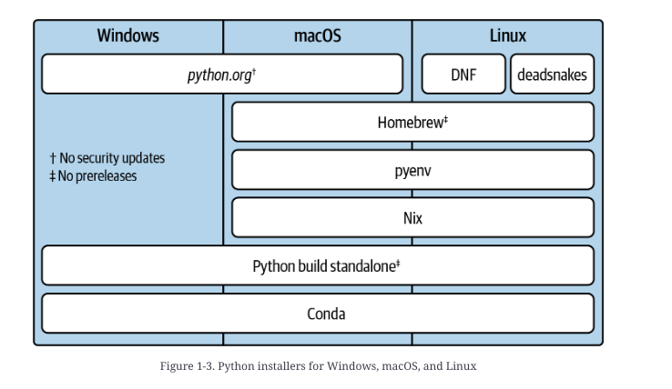
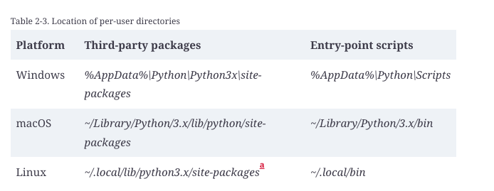
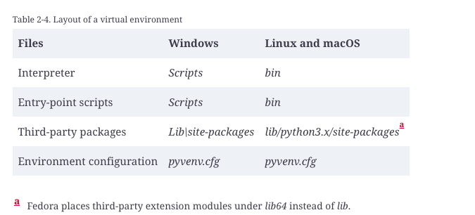

# Hypermodern Python Tooling
https://learning.oreilly.com/library/view/hypermodern-python-tooling/9781098139575/ch02.html 


# Python batteries

Friday, 6 December 2024
12:09 PM

attrs, attrib for class creation
By default, pyenv does not enable profile-guided optimization (PGO) or link-time optimization (LTO) when building the interpreter. According to the Python Performance Benchmark Suite, these optimizations can lead to a significant speedup for CPU-bound Python programs—​between 10% and 20%. You can enable them using the PYTHON_CONFIGURE_OPTS environment variable:

https://oreil.ly/OkzM9
$ export PYTHON_CONFIGURE_OPTS='--enable-optimizations --with-lto'


If the practical advantages of the shim mechanism convince you, you may also like asdf, a generic version manager for multiple language runtimes; its Python plugin uses python-build internally.

If you like per-directory version management but don’t like shims, take a look at direnv, which can update your PATH whenever you enter a directory. (It can even create and activate virtual environments for you.)


A Brave New World: Installing with Hatch and Rye
While I was writing this book, the Python project managers Rye and Hatch added support for installing Python interpreters on all major platforms. Both use interpreters from the Python Standalone Builds collection and the PyPy project.


$ hatch python install all
$ rye fetch 3.12
$ rye fetch 3.11.8
$ rye fetch pypy@3.10

```sh  
    python3 -m sysconfig

    sys.builtin_module_names
```
### Simple modules
In the simplest case, a module is a single file containing Python source code. The statement import string executes the code in string.py and binds the result to the name string in the local scope.

### Packages
Directories with __init__.py files are known as packages—they allow you to organize modules in a hierarchy. The statement import email.message loads the message module from the email package.

### Namespace packages
Directories with modules but no __init__.py are known as namespace packages. You use them to organize modules in a common namespace such as a company name (say acme.unicycle and acme.rocketsled). Unlike with regular packages, you can distribute each module in a namespace package separately.

### Extension modules
Extension modules, such as the math module, contain native code compiled from low-level languages like C. They’re shared libraries2 with a special entry point that lets you import them as modules from Python. People write them for performance reasons or to make existing C libraries available as Python modules. Their names end in .pyd on Windows, .dylib on macOS, and .so on Linux.

### Built-in modules
Some modules from the standard library, such as the sys and builtins modules, are compiled into the interpreter. The variable sys.builtin_module_names lists all of these modules.

### Frozen modules
Some modules from the standard library are written in Python but have their bytecode embedded in the interpreter. Originally, only core parts of importlib got this treatment. Recent versions of Python freeze every module that’s imported during interpreter startup, such as os and io.

Note


## Bytecode
Bytecode is an intermediate representation of Python code that is platform-independent and optimized for fast execution. The interpreter compiles pure Python modules to bytecode when it loads them for the first time. Bytecode modules are cached in the environment in .pyc files under __pycache__ directories.


```python
import importlib.util
import sys

for name in sorted(sys.stdlib_module_names):
    if spec := importlib.util.find_spec(name):
        print(f"{name:30} {spec.origin}")


% Example 2-2. Listing packages installed in the environment
import importlib.metadata

distributions = importlib.metadata.distributions()
for distribution in sorted(distributions, key=lambda d: d.name):
    print(f"{distribution.name:30} {distribution.version}")
```

### The Per-User Environment
Per-user environments have an important shortcoming: by design, they’re not isolated from the global environment. You can still import system-wide site packages if they’re not shadowed by per-user modules with the same name. Applications in the per-user environment also aren’t isolated from each other—​in particular, they can’t depend on incompatible versions of another package. Even applications in the system-wide environment can import modules from the per-user environment.

And there’s another drawback: you can’t install packages into the per-user environment if the Python installation is marked as externally managed—for example, if you installed Python using the package manager of your distribution.

python3 -m pip install --user <package>


In “Installing Applications with pipx”, I’ll introduce pipx, which lets you install applications in isolated environments. It uses the per-user script directory to put applications onto your search path but relies on virtual environments under the hood.

https://learning.oreilly.com/library/view/hypermodern-python-tooling/9781098139575/ch02.html#**section_environments_pipx** 


### Virtual Environments


Virtual environments come with the version of pip that was current when Python was released. This can be a problem when you’re working with an old Python release. Create the environment with the option --upgrade-deps to ensure you get the latest pip release from the Python Package Index.

You can also create a virtual environment without pip using the option --without-pip and install packages with an external installer. If you have pip installed globally, you can pass the target environment using its --python option, like this:

```sh
$ pip --python=.venv install httpx
```
It’s easy to install a package into the Python installation or per-user environment by accident—​especially if you’re used to invoking pip directly. If your Python installation isn’t marked as externally managed, you may not even notice. Fortunately, you can configure pip to always require a virtual environment when installing packages:
```sh
$ pip config set global.require-virtualenv true
```
They set the VIRTUAL_ENV environment variable to the location of the virtual environment. Tools like the Python Launcher use this variable to detect that the environment is active.

If its parent directory contains a pyvenv.cfg file, Python treats that file as a landmark for a virtual environment and imports third-party modules from the site-packages directory beneath.   
While the virtual environment has access to the standard library in the system-wide environment, it’s isolated from its third-party modules. (Although not recommended, you can give the environment access to those modules as well, using the --system-site-packages option when creating the environment.)

How does pip know where to install packages? The short answer is that pip asks the interpreter it’s running on, and the interpreter derives the location from its own path—​just like when you import a module.7 This is why it’s best to run pip with an explicit interpreter using the py -m pip idiom. If you invoke pip directly, the system searches your PATH and may come up with the entry-point script from a different environment.   

Unfortunately, managing and activating a separate virtual environment for every application is cumbersome and confusing—​and it limits you to using only a single application at a time. Wouldn’t it be great if we could confine applications to virtual environments and still have them available globally?

On top of this simple idea, the pipx project has built a cross-platform package manager for Python applications with a great developer experience.

Tip
If there’s a single Python application that you should install on a development machine, pipx is probably it. It lets you install, run, and manage all the other Python applications in a way that’s convenient and avoids trouble.

Installing pipx
If your system package manager distributes pipx as a package, I recommend using that as the preferred installation method, as it’s more likely to provide good integration out of the box:

$ apt install pipx
$ brew install pipx
$ dnf install pipx
As a post-installation step, update your PATH environment variable to include the shared script directory, using the ensurepath subcommand. (If you’ve modified your PATH variable when running the commands above, open a new terminal first.)

$ pipx ensurepath
On Windows, and if your system package manager doesn’t distribute pipx, I recommend installing pipx into the per-user environment, like this:

$ py -m pip install --user pipx
$ py -m pipx ensurepath
The second step also puts the pipx command itself on your search path.

If you don’t already have shell completion for pipx, activate it by following the instructions for your shell, which you can print with this command:

$ pipx completions
Managing Applications with pipx
With pipx installed on your system, you can use it to install and manage applications from the Python Package Index (PyPI). For example, here’s how you would install Black with pipx:

$ pipx install black
You can also use pipx to upgrade an application to a new release, reinstall it, or uninstall it from your system:

$ pipx upgrade black
$ pipx reinstall black
$ pipx uninstall black
As a package manager, pipx keeps track of the applications it installs and lets you perform bulk operations across all of them. This is particularly useful to keep your development tools updated to the latest version and to reinstall them on a new version of Python:

$ pipx upgrade-all
$ pipx reinstall-all
$ pipx uninstall-all
You can also list the applications you’ve installed previously:

$ pipx list


Running Applications with pipx
The previous commands provide all the primitives to manage global developer tools efficiently, but it gets better. Most of the time, you just want to use recent versions of your developer tools. You don’t want the responsibility of keeping the tools updated, reinstalling them on new Python versions, or removing them when you no longer need them. Pipx allows you to run an application directly from PyPI without an explicit installation step. Let’s use the classic Cowsay app to try it:

pipx run cowsay -t moo


Behind the scenes, pipx installs Cowsay in a temporary virtual environment and runs it with the arguments you’ve provided. It keeps the environment around for a while,8 so you don’t end up reinstalling applications on every run. Use the --no-cache option to force pipx to create a new environment and reinstall the latest version.

Configuring pipx
By default, pipx installs applications on the same Python version that it runs on itself. This may not be the latest stable version, particularly if you installed pipx using a system package manager like APT. I recommend setting the environment variable PIPX_DEFAULT_PYTHON to the latest stable Python if that’s the case. Many developer tools you run with pipx create their own virtual environments; for example, virtua⁠l­env, Nox, tox, Poetry, and Hatch all do. It’s worthwhile to ensure that all downstream environments use a recent Python version by default:

$ export PIPX_DEFAULT_PYTHON=python3.12 # Linux and macOS
> setx PIPX_DEFAULT_PYTHON python3.12   # Windows
Under the hood, pipx uses pip as a package installer. This means that any configuration you have for pip also carries over to pipx. A common use case is installing Python packages from a private index instead of PyPI, such as a company-wide package repository.

You can use pip config to set the URL of your preferred package index persistently:

$ pip config set global.index-url https://example.com
$ export PIP_INDEX_URL=https://example.com

### Managing Environments with uv
The tool uv is a drop-in replacement for core Python packaging tools, written in the Rust programming language. It offers order-of-magnitude performance improvements over the Python tools it replaces, in a single static binary without dependencies. While its uv venv and uv pip subcommands aim for compatibility with virtualenv and pip, uv also embraces evolving best practices, such as operating in a virtual environment by default.

You can install packages into another environment by activating it—​this works for both virtual environments (VIRTUAL_ENV) and Conda environments (CONDA_PREFIX). 
```sh
$ pipx install uv
$ uv venv
```